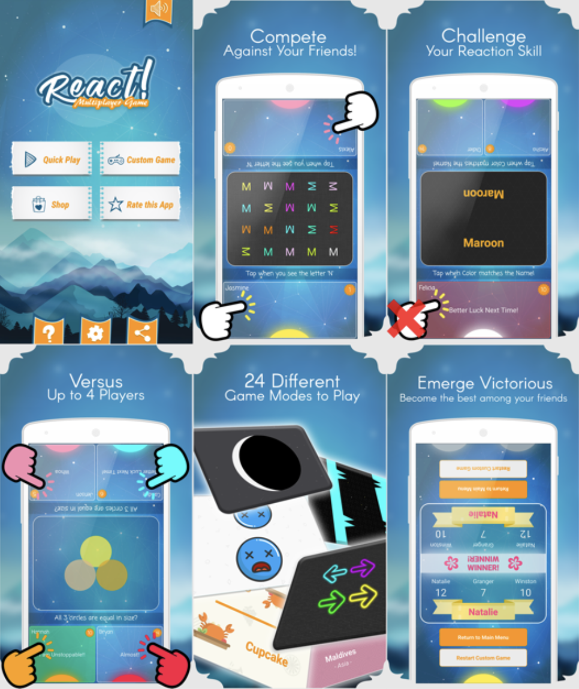

This is the code repository for the android app [React! Multiplayer Game](https://play.google.com/store/apps/details?id=com.react.reactmultiplayergame).

# About

React! Multiplayer Game is an Android multiplayer reaction game in which up to four players can play on the same phone and participate in various mini-games. These mini-games test the players' reactions by requiring them to tap on their buttons when specific conditions are met.

# Features

- 4 level difficulty: Easy, Medium, Hard, and Insane
- Play with 2-4 Players on the same device
- 24 different mini games

# Installation

This app will no longer be maintained. Since the source code is more than 6 years old, it probably requires lots of changes to gradle and the build files before you can build it. Many android APIs may no longer work if built with newer version of Android.

All secret keys have been modified with `SAMPLE_TO_REPLACE`. Replace them with your own.
